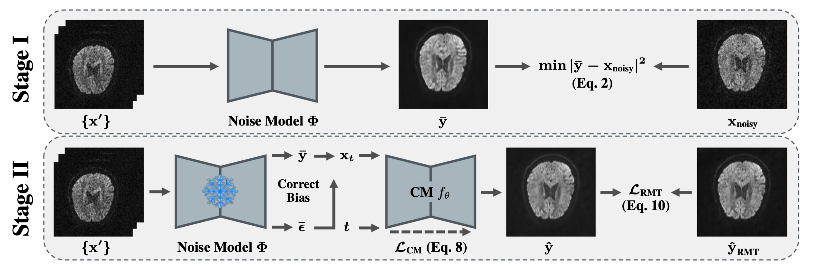
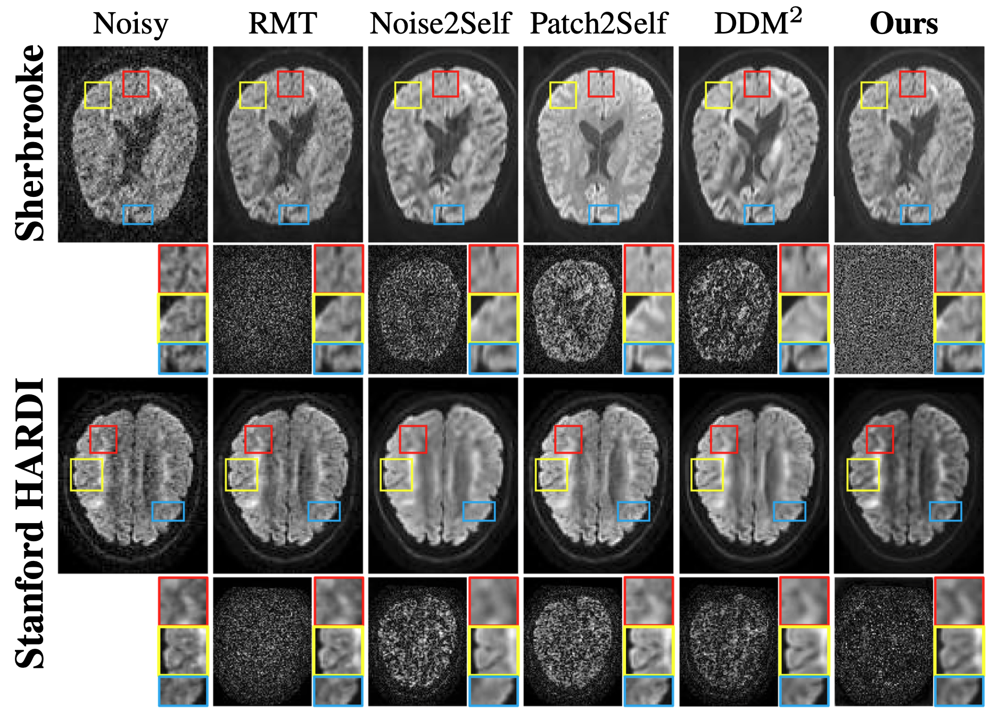

# CoDe: A Self-Supervised Consistency Model Framework for MRI Denoising | ISBI 2026

**Paper:** [IEEE Xplore](https://ieeexplore.ieee.org/document/11515485)

## Overview

**CoDe** is a self-supervised consistency model framework for MRI denoising. It is designed to denoise MRI data without paired clean ground-truth images. The current implementation focuses on diffusion MRI and uses a two-stage pipeline.

- **Stage I:** train a noise estimation model from independent noisy measurements.
- **Stage II:** train a consistency model for fast one-step denoising.
- **RMT/MPPCA:** generate an RMT-denoised reference for Stage II regularization.

---

## Architecture

<!-- Insert architecture figure here. Suggested path: assets/code_architecture.png or assets/code_architecture.pdf -->

<p align="center">
  
</p>

<p align="center">
  <em>Figure 1. CoDe architecture. Stage I estimates an approximated clean image from independent noisy inputs. Stage II refines the result using consistency-model denoising and RMT regularization.</em>
</p>

---

## Results

<!-- Insert qualitative result figure here. Suggested path: assets/code_results.png or assets/code_results.pdf -->

<p align="center">
  
</p>

<p align="center">
  <em>Figure 2. Qualitative denoising results. CoDe reduces noise while preserving anatomical details compared with baseline methods.</em>
</p>

---

## Repository Setup

Clone the repository:

```bash
git clone https://github.com/YOUR_USERNAME/CoDe-model-main.git
cd CoDe-model-main
```

Create the conda environment using the provided environment file in the outermost repository folder:

```bash
conda env create -f CoDe_env.yml
conda activate CoDe
```

If your environment name in `CoDe_env.yml` is different, activate that name instead:

```bash
conda env list
conda activate <environment_name>
```

---

## Data Format

The input should be a 4D diffusion MRI NIfTI file:

```text
H × W × S × V
```

where `H` and `W` are image dimensions, `S` is the number of slices, and `V` is the number of diffusion volumes.

Example datasets:

```text
Stanford HARDI:
dwi_data/HARDI150.nii.gz

Sherbrooke 3-shell:
dwi_data/HARDI193.nii.gz
```

You can download both datasets through DIPY.

```bash
dipy_fetch stanford_hardi --out_dir dwi_data
dipy_fetch sherbrooke_3shell --out_dir dwi_data
```

Dataset references:

- Stanford HARDI: available through DIPY as `stanford_hardi`.
- Sherbrooke 3-shell: available through DIPY as `sherbrooke_3shell`; the dataset record is also hosted by the University of Washington ResearchWorks at `http://hdl.handle.net/1773/38466`.

---

## Basic Training and Testing Commands

The full pipeline is:

```text
RMT preprocessing → Stage I training → Stage II training → Testing
```

### 1. Run RMT / MPPCA preprocessing

```bash
bash run_rmt.sh
```
Skip this step if you do not use RMT regularization.

### 2. Train Stage I noise estimation model

```bash
bash run_stage1.sh
```

### 3. Train Stage II consistency model

```bash
bash run_stage2.sh
```

### 4. Test / run inference

```bash
bash run_test.sh
```

---

## Notes

- `CoDe_env.yml` should be placed in the outermost repository folder, at the same level as `README.md`.
- Before running, replace all placeholder paths in the `.sh` files with real paths.
- Use `target_model300000.pt` for testing.
- If using `--loss_norm lpips_rmt`, make sure `--rmt_npy_path` points to a valid `denoised_mppca.npy` file.
- If not using RMT regularization, change `--loss_norm lpips_rmt` to `--loss_norm lpips`, `l1`, or `l2`, and remove `--rmt_npy_path`.
- To select a GPU, run commands with `CUDA_VISIBLE_DEVICES`

---

## Citation

```bibtex
@inproceedings{code2026,
  title     = {CoDe: A Self-Supervised Consistency Model Framework for MRI Denoising},
  author    = {Li, Junying and Hou, Qingyang and Pang, Kaifeng and Miao, Qi and Hung, Alex Ling Yu and Aygun, Elif and Shih, Shu-Fu and Dai, Qing and Wu, Holden H. and Sung, Kyunghyun},
  booktitle = {IEEE International Symposium on Biomedical Imaging},
  year      = {2026}
}
```

## License

This repository is released under the MIT License.
